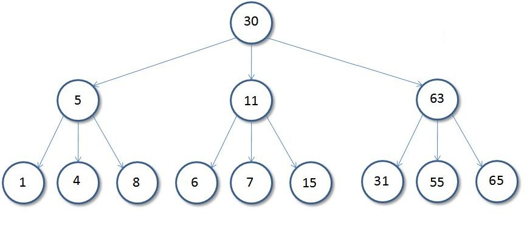
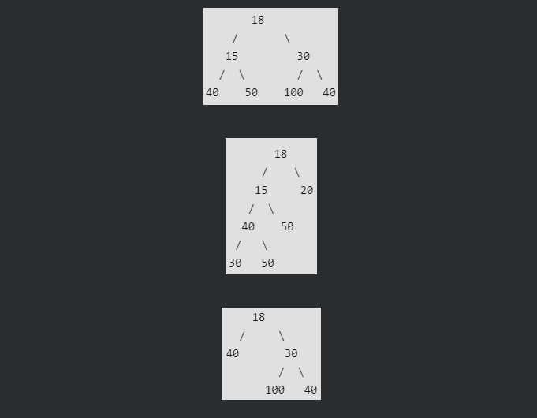
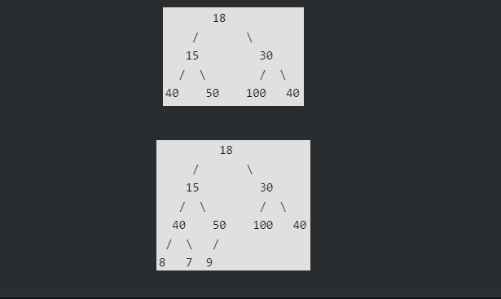

# Tree
 A Tree is a non-linear data structure where each node is connected to a number of  nodes with the help of pointers or references.

 

 - **child:** node just below a node connected directly by a edge
 
 - **parent:** node just above a node
 
 - **siblings:** nodes with same parents
 
 - **subtree:** a tree itself contains many trees, which are called subtree
 
 - **balanced tree:** the left and right subtree height differ by atmost 1

 - **descendent:** descendent of a node are all nodes the lies in subtree rooted 
 this node, descendent of 5 are 1 4 8
 
 - **ancestor:** ancestor of 6 is 11 and 30
 
 - **degree:** no of childs of a node
 
 - **leaf:** nodes with zero degree
 
 - **internal:** nodes which are not leaf, nodes having childrens 

 

 - **level:** Level of a node represents the generation of a node. If the root node is at level 0, then its next child node is at level 1

 - **depth:** The depth of a node is the number of edges from the node to the tree's root node. A root node will have a depth of 0.
 
 - **height:** The height of a node is the number of edges on the longest path from the node to a leaf. A leaf node will have a height of 0.
 
 - **diameter:** The diameter (or width) of a tree is the number of nodes on the longest path between any two leaf nodes. The tree above has a diameter of 6 nodes.

 ## Binary Tree
 A Tree is said to be a Binary Tree if all of its nodes have atmost 2 children. 
 
 

 Properties of a Binary Tree:
  - The maximum number of nodes at level 'l' of a binary tree is **2^l**. Level of root is 0.

  - Maximum number of nodes in a binary tree of height 'h' is **2^(h+1) – 1** , height of leaf node is 0.

  - In a Binary Tree with N nodes, the minimum possible height or the minimum number of levels **Log(N+1) – 1**, height of leaf node is 0

  - A Binary Tree with L leaves has at least **LogL + 1** levels.

 Types of Binary Trees:
   - **Full Binary Tree:** A Binary Tree is full if every node has either 0 or 2 children. In a full Binary tree, number of leaf nodes is always one more than nodes with two children. *Intuition:* no of nodes at level h-1 (2^h-1), no of node at level h is 2^h
    

   - **Complete Binary Tree:** A Binary Tree is complete Binary Tree if all levels are completely filled except possibly the last level and the last level has all keys as left as possible
    

   - **Perfect Binary Tree:** A Binary tree is Perfect Binary Tree in which all internal nodes have two children and all leaves are at the same level. A perfect binary tree is both full and complete binary tree.

 Application of tree:
   - to represent hierarchial data(Folder Structure, HTML Data, Inheritance).
   - Binary Search tree
   - Binary Heaps
   - B and B+ tree in DBMS
   - Other applications:
     - trie
     - suffix
     - binary index tree
     - segment tree

 Tree traversal:
   - preorder: CLR
   - inorder: LCR
   - postorder: LRC
     