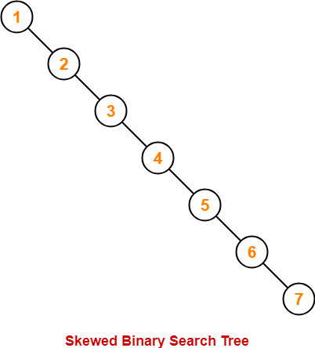

# Binary Search Tree
 - for every node, keys in left side are smaller and keys in right are larger.
 
 - all keys are distinct

 - it is a linked data structure, no limit on size, but less cache friendly
 
 - BST is implemented in map, mutimap, set and multiset
 
 - height of BST becomes maximum when we insert elements in increasing or decreasing order
 
   

 ## BST vs hashing
 Operation | BST | BST(balanced) | Hashing
 --------- | --- | ------------- | -------
 **search** | O(h) | O(log(n)) | O(1)
 **insert** | O(h) | O(log(n)) | O(1)
 **delete** | O(h) | O(log(n)) | O(1)
 **find closest** | O(h) | O(log(n)) | O(n)
 **sorted traversal** | O(n) | O(n) | O(n(log(n)))

 ## Self Balancing BST
  