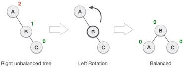
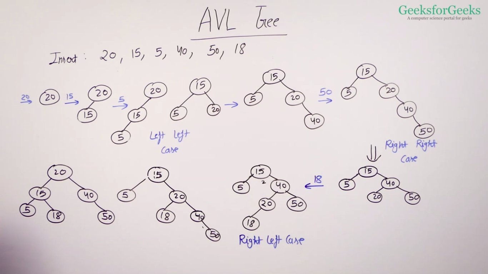
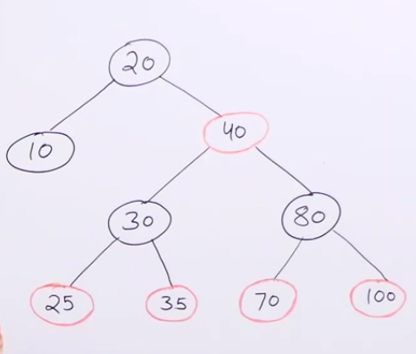
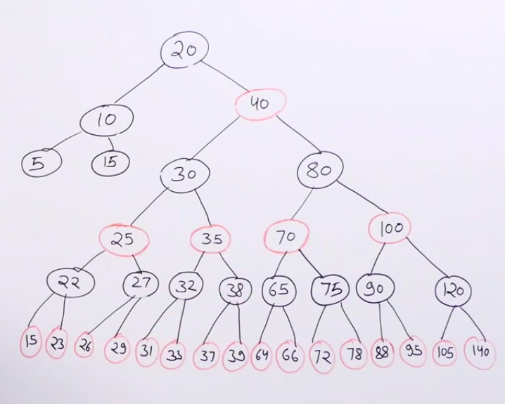

# Binary Search Tree
 - for every node, keys in left side are smaller and keys in right are larger.
 
 - it is a linked data structure, no limit on size, but less cache friendly
 
 - BST is implemented in map, mutimap, set and multiset
 
 - height of BST becomes maximum when we insert elements in increasing or decreasing order
 
   

## BST vs hashing
 Operation | BST | BST(balanced) | Hashing
 --------- | --- | ------------- | -------
 **search** | O(h) | O(log(n)) | O(1)
 **insert** | O(h) | O(log(n)) | O(1)
 **delete** | O(h) | O(log(n)) | O(1)
 **find closest** | O(h) | O(log(n)) | O(n)
 **sorted traversal** | O(n) | O(n) | O(n(log(n)))

## Self Balancing BST
 Self-Balancing Binary Search Trees are height-balanced binary search trees that automatically balances its height on insertion and deletion so that all operation takes log(n) time.

 - We can always make a Balanced BST if we know the keys in advance( by sorting them and always picking mid in each side).

 - We can do extra work in insertion and deletion to make self balanced BST, if we don't know the keys in advance.

 ### Rotations

  Left Rotation

  

  Right Rotation

  

  Generalisation

  


  There are many self Balancing BSTs. Two of them are:
  - AVL Tree
  - Red Black Tree

 ## AVL Tree
  It uses **balance factor ( |leftHeight-rightHeight| )**  for balancing. balance factor<=1
 
  ### Insert operation
   1. perfrom normal BST insert
   
   2. traverse all ancestor from newly inserted node to root

   3. if found any unbalanced node, check for following cases:
      1. left left (right rotation)
      2. right right (left rotation)
      3. left right (left then right rotation)
      4. right left (Right then left rotation)
   
   4. if found any unbalanced node, further we don't need to check. 
  
  ### delete operation
   1. perfrom normal BST delete
   
   2. traverse all ancestor from newly deleted node to root

   3. if found any unbalanced node, check for following cases:
      1. left left (right rotation)
      2. right right (left rotation)
      3. left right (left then right rotation)
      4. right left (Right then left rotation)
   
   4. continue traversing upto root even if found, and do rotations accrording to point 3.

   

  ## Red Black tree
   Red Black tree is also a self balancing BST with following properties:
   
   - Every node has a color either red or black.
   
   - The root of tree is always black.
	 
   - There are no two adjacent red nodes (A red node cannot have a red parent or red child).
	 
   - Every path from a node (including root) to any of its descendant leaf node has the same  number of black nodes.

  
  
    In case of unbalancing, we first try to do recolouring and if that doesn't work then we do rotations.

  
  

    Number of nodes on the path from a node to its farthest descendant leaf should not be more than twice the number of nodes on the path to its closest descendant leaf. 

    If we compare this balancing with AVL tree we are allowed to have difference of atmost one b/n two heights and here we are allowed to have difference twice. That's why we say AVL tree is more strict than Red Black Tree. 


   ***Advantages of being loose:*** 
   - In Red Black tree, less number of rotation happens when do insertion and deletion because of less restructuring
   - AVL trees store the balance factor at each node. This takes O(N) extra space. However, if we know that the keys that will be inserted in the red black tree will always be greater than zero, we can use the sign bit of the keys to store the colour information of a red-black tree. Thus, in such cases red-black tree takes no extra space. 

   ***Disadvantage of being loose:*** 
   - hight may become high, so search becomes costly. So if we have more search operation, we use AVL tree, if we have mixed operation then Red Black Tree is preferred. 


  ## Application of Balanced BST(self)
   - to implement doubly ended priority queue
   - to solve problems like:
     - count smaller/greater in a stream
     - floor/ceiling/greater/smaller in a stream
   - In STL, set and map are implemented using red black tree.

  ## Set
    since set is implementation of self balancing BST(Red Black Tree), use it wherever we need self balancing BST. By default values are stored in increasing order.

    It has few important member functions like lower_bound, upper_bound

   ```c++
      auto it = s.lower_bound(2);

       
   ```

  ## Map
    map is also implementation of self balancing BST(Red Black Tree), but it stores (key,value) pair. items are oredered according to key. By default, items are stored in increasing order of keys.

    - if we give ptr to its erase() member fn it can delete in O(1) in set and map.
   
   ```c++
    map<int, int> mp;
    mp.insert({1, 10});
    cout<<mp[1]; // -> 10

    mp.insert({1, 20}); // will be ignored
    cout<<mp[1]; // -> 10
    
    mp[1] = 20; // updated
    cout<<mp[1]; // -> 20
    
    cout<<mp.size()<<endl; // -> 1
    mp[2]; // if not present, key 2 will be inserted with default value 0 {2, 0}
    cout<<mp[2]<<" "<<mp.size()<<endl; // -> 0 2

    cout<<mp.at(3)<<endl; // throws out of range exception
    mp.at(3) = 100; // throws out of range exception
    // at works like [] but if key is not present it throws out of range exception unlike [] which inserts key with default value
    
    // lower_bound : item or next item
    // upper_bound : next item
    // if key is stored in decreasing order, then (this property is only true for map and set)
    map<int, int, greater<int>> mp;
    mp.insert({5, 50});
    mp.insert({3, 30});
    mp.insert({1, 10});

    
    //lower_bound
    auto it = mp.lower_bound(2);
    if(it!=mp.end())
        cout<<(*it).first<<endl;// -> 1 
    
    auto it2 = mp.lower_bound(4);
    if(it!=mp.end())
        cout<<(*it).first<<endl;// -> 3 
    
    auto it3 = mp.lower_bound(3);
    if(it!=mp.end())
        cout<<(*it).first<<endl;// -> 3 
    
    auto it3 = mp.lower_bound(0);
    if(it!=mp.end())
        cout<<(*it).first<<endl;// -> not found 
    
    auto it3 = mp.lower_bound(7);
    if(it!=mp.end())
        cout<<(*it).first<<endl;// -> 5

    
    // upper_bound
    auto it = mp.upper_bound(2);
    if(it!=mp.end())
        cout<<(*it).first<<endl;// -> 1

    auto it = mp.upper_bound(4);
    if(it!=mp.end())
        cout<<(*it).first<<endl;// -> 3

    auto it = mp.upper_bound(3);
    if(it!=mp.end())
        cout<<(*it).first<<endl;// -> 1
    
    auto it = mp.upper_bound(5);
    if(it!=mp.end())
        cout<<(*it).first<<endl;// -> 3
    
    auto it = mp.upper_bound(1);
    if(it!=mp.end())
        cout<<(*it).first<<endl;// -> not found
    
    auto it = mp.upper_bound(7);
    if(it!=mp.end())
        cout<<(*it).first<<endl;// -> 5


  ```


  
   


  