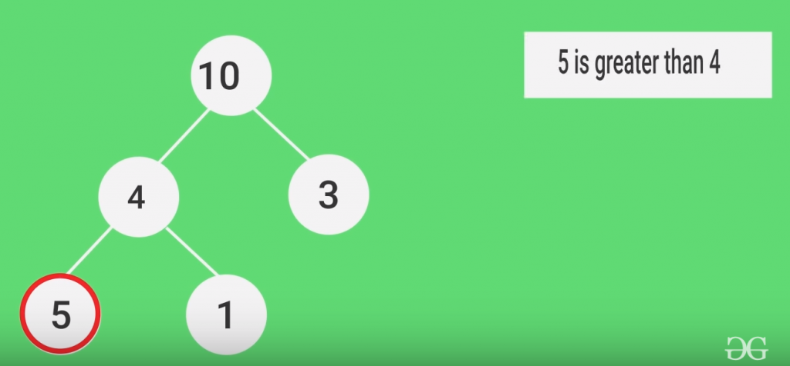

# Heap
 A Heap is a Tree-based data structure, which satisfies the below properties:
 1. A Heap is a complete tree (All levels are completely filled except possibly the last level and the last level has all keys as left as possible).

 2. A Heap is either Min Heap or Max Heap. In a Min-Heap, the key at root must be minimum among all keys present in the Binary Heap. The same property must be recursively true for all nodes in the Tree. Max Heap is similar to MinHeap.

 **Binary Heap**: A Binary Heap is a heap where each node can have at most two children.

 

 ### Representing Binary Heaps
 Since a Binary Heap is a complete Binary Tree, it can be easily represented using Arrays:
 1. Arr[0]: **Root element**.
 2. Below table shows indexes of other nodes for the ith node, i.e., Arr[i]:
    - Arr[(i-1)/2]: **parent node**
    - Arr[(2*i)+1]: **left child node**
    - Arr[(2*i)+2]: **right child node**

 ### Heapify
 In max heap, To heapify a particular node swap the value of the node with the maximum value of its children nodes and continue the process until all of the nodes below it satisfies the Heap property.

 **Time Complexity**:  O( log(n) )  /  O(h)
 
 

 
 
 

 ## Applications
 - heap sort
 - implementation of priority queue.

 ### Advantage of being complete binary tree and stored in array
 - random acess
 - cache friendly
 - log(n) height, less complexity in heapify
 - memory is not wasted in storing left and right pointer

 

