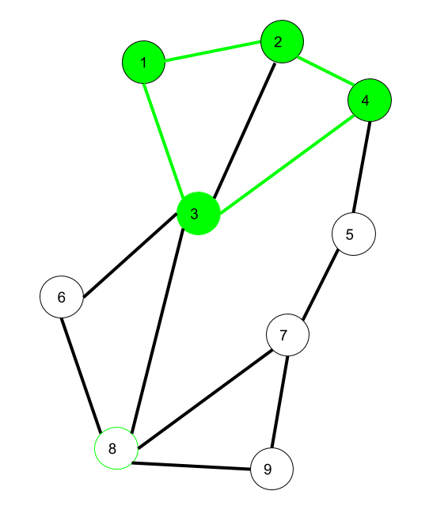

# Graph
A Graph is a data structure that consists of the following two components:
 1. A finite set of vertices also called nodes.
 2. A finite set of ordered pair of the form (u, v) called as edge. The pair is ordered because (u, v) is not the same as (v, u) in case of a directed graph(digraph). The pair of the form (u, v) indicates that there is an edge from vertex u to vertex v. The edges may contain weight/value/cost.

### Application:
 1. Graphs are used to represent networks like telephone networks.
 2. Graphs are also used in social networks like linkedIn, Facebook.
 
 ## Directed vs Undirected Graph
  1. The Directed graphs are such graphs in which edges are directed in a single direction. (u,v) is not same as (v,u) whereas undirected graph is directionless, (u,v) is same as (v,u).
     - Number of odd degree vertices is even
     - Sum of degrees of all vertices is even

  2. Real world example of undirected will be social network, if v is friend of u then u is also friend of v. example of directed graph is world wide web, consider pages as vertices, and edges show link between pages

  

  Maximum number of edges in directed graph is valid if it has no self loops and no parallel edges.

  ### Termonologies

   1. **Parallel edges/ Multiple edges:** In a graph, if a pair of vertices is connected by more than one edge, then those edges are called parallel edges. if graph is directed, then edges direction should be same. A graph having parallel edges is called **MultiGraph**

        

   2. **walk:**
      - A walk is a sequence of vertices and edges of a graph i.e. if we traverse a graph then we get a walk
      - Vertex can be repeated
      - Edges can be repeated
      - If start vertex and end vertex are same then closed walk, else open walk

        

     Here 1->2->3->4->2->1->3 is a walk.
     
  
   3. **trail:**
      - no edge can be repeated, vertices can repeat.

         

    Here 1->3->8->6->3->2 is trail
    Also 1->3->8->6->3->2->1 will be a closed trail, closed trail is also called circuit

   4. **Path:** A traversal in which neither vertices nor edges are repeated.

         
    
    Here 6->8->3->1->2->4 is a Path

   5. **Cycle:** Cycle is a closed path.

         

    Here 1->2->4->3->1 is a cycle.

 ## Types of Graphs:

   

   1. ***Directed graph:*** A graph in which the direction of the edge is defined to a particular node is a directed graph.
      - **Directed Acyclic graph:** It is a directed graph with no cycle.For a vertex ‘v’ in DAG there is no directed edge starting and ending with vertex ‘v’.
         - a) Application :expression tree evaluation, used with Topological sorting for scheduling.
      - **Tree:** A tree is just a restricted form of graph.That is, it is a DAG with a restriction that a child can have only one parent.
   2. ***Undirected graph:*** A graph in which the direction of the edge is not defined. So if an edge exists between node ‘u’ and ‘v’,then there is a path from node ‘u’ to ‘v’ and vice versa.
      - **Connected graph:** A graph is connected when there is a path between every pair of vertices.
      - **Complete graph:** A graph in which each pair of graph vertices is connected by an edge. In other words,every node ‘u’ is adjacent to every other node ‘v’ in graph ‘G’. A complete graph would have n(n-1)/2 edges.
      - **Biconnected graph:** A connected graph which cannot be broken down into any further pieces by deletion of any vertex. It is a graph with no articulation point.

 ### Bipartite Graph
  graph G is said to be bipartite if its vertex set V can be divided into two disjoint sets such that every edge in G has its initial vertex in the first set and the terminal vertex in the second set. Total number of edges are (n*m) with (n+m) vertices in bipartite graph.
   
    graph with no odd length cycles and self loop is bipartite

   

 ## Representation of graph
  
   
  
  ### Adjacency Matrix:
   - Adjacency Matrix is a 2D array of size V x V where V is the number of vertices in a graph.
   - Let the 2D array be adj[][], a slot adj[i][j] = 1 indicates that there is an edge from vertex i to vertex j. Adjacency matrix for undirected graph is always symmetric.
   - Adjacency Matrix is also used to represent weighted graphs. If adj[i][j] = w, then there is an edge from vertex i to vertex j with weight w.

      

 ### Adjacency list:
  - Graph can also be implemented using an array of lists.  Size of the array is equal to the number of vertices and every index i in the array will store the list of vertices connected to the vertex numbered i. In directed graph we consider out degree to mantain adajaceny list

      

 Parameter | Adjacency List | Adjacency Matrix
 --------- | -------------- | ----------------
 memory | O(V+E) | O(V*V)
 check if edge from u to v | O(V) | O(1)
 find all adajacent nodes of u | O(degree(u)) | O(V)
 add an edge | O(1) | O(1)
 remove an edge | O(V) | O(1)
 adding a vertex | easier(implentation dependent) | O(V*V)
 suitable | sparse  | dense
 BFS | O(V+E) | O(V*V)
 Djikstra, Prims | Higher complexity | lower complexity

 ## Types of Edges
  - **Tree edges**: edges that come in DFS traversal
  - **Forward edges:** edges which are not tree edges and are from ancestor to descendant
  - **Back edges:** edges which are not tree edges and are from descendant to ancestor
  - **cross edges:** edges which are not above three
   

 ## Minimum Spanning Tree
  - A minimum spanning tree (MST) or minimum weight spanning tree is a subset of the edges of a **connected, edge-weighted undirected graph** that connects all the vertices together, without any cycles and with the minimum possible total edge weight.

  - A minimum spanning tree has (V – 1) edges where V is the number of vertices in the given connected undirected graph.

   ### Prime's algo for MST
   - **Idea**
      - maintain a set included, first pick any element in included
      - while every element is not in included
        - find edge with minimum weight from included to not included, mark that not included vertex included   
   - **Algo**
      - created a boolean included set to keep track of already included set.
      - create a keys array and set INF to all elements, set key[0] = 0
      - traverse through all vertices,
         - Pick a vertex u which is not there in included and has minimum key value.
         - Include u to mstSet, ans += keys[u] 
         - for each not included adjacent vertex, keys[j]>weight(u, j) then keys[j]=weight(u,j).

 ## Topological Sort
  Topological sorting for Directed Acyclic Graph (DAG) is a linear ordering of vertices such that for every directed edge uv, vertex u comes before v in the ordering. Topological Sorting for a graph is not possible if the graph is not a DAG.

 ## Shortest Path in Unweighted graph
 - Use BFS

 ## Shortest path in DAG
  - intialize all distance to INF except source
  - do topological sort
  - traverse in topological order and change distance of adjacent vertices

 ## Dijkstra's Shortest Path Algorithm
  - intialize all distance to INF except source
  - while all vertex are not finalised
    - find minimum among distances which are not finalised and change distances of adjacent unvisited vertices, mark current vertex as visited.
      - Update key value of all adjacent vertices of u, if v not included keys[v] = min(keys[v], adj[u][v])

  - Dijkstra's algo cannot be used in graph having negative weight.

 ## Bellman Ford Shortest Path Algo
  - works for negative weights but fail in negative weight cycle

    
  
  - Algo:
    - initialize distances from the source to all vertices as infinite and distance to the source itself as 0.
    - Do following V-1 times
      - for each edge(u,v), If dist[v]>dist[u]+weight(u,v) then dist[v]=dist[u]+weight(u,v)
    - check negative weight cycle, for each edge if dist[v]>dist[u]+weight(u,v) then negative weight cycle 

 ## Strongly connected componenets
  A set of vertices which have path between all pair of vertices is called strongly connected components.

   - In Undirected graph, do BFS or DFS from a vertex, all vertices which are reachable from that vertex are strongly connected

   - for directed graph, use Kosaraju Algo or Tarjan's Algo
 
 ### Application:
  - To find a group of people who are strongly connected in social media. Many people in these groups generally like some common pages or play common games.
 
 ## Kosaraju Algo
  - Idea:
    - Do DFS from sink to source.
  - Algo:
    - do dfs and store vertex according to their finish time.
    - reverse adjList
    - pop from stack and do dfs, all reachable vertex are strongly connected.
 
 ## Tarjan's Algo
  - DFS of a graph produces a single tree if all vertices are reachable from the DFS starting point. Otherwise DFS produces a forest.
  - So DFS of a graph with only one SCC always produces a tree. The important point to note is DFS may produce a tree or a forest when there are more than one SCCs depending upon the chosen starting point
  - Algo:
    - similar to articulation point but it has cross edge, undirected graph dont have cross edge
    - when we find an vertex whose all children are visited and its low is equal to disc then it is begining of strongly connected component.

 ## Bridges 
  - An edge in an undirected graph is a bridge iff removing it increases the number of connected components. 
  -  In DFS tree an edge (u, v) (u is parent of v in DFS tree) is bridge if there does not exist any other alternative to reach u or an ancestor of u from subtree rooted with v.

 ## Articulation Point
  - A vertex in an undirected connected graph is an articulation point (or cut vertex) iff removing it (and edges through it) disconnects the graph.
  - For a disconnected undirected graph, an articulation point is a vertex removing which increases number of connected components.
  - Articulation points represent vulnerabilities in a connected network – single points whose failure would split the network into 2 or more components.

   
   
  
  - In DFS tree, a vertex u is articulation point if one of the following two conditions is true.
   1. u is root of DFS tree and it has at least two children.
   2. u is not root of DFS tree and it has a child v such that no vertex in subtree rooted with v has a back edge to one of the ancestors (in DFS tree) of u.