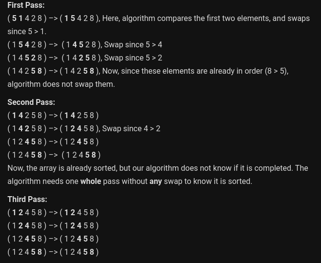
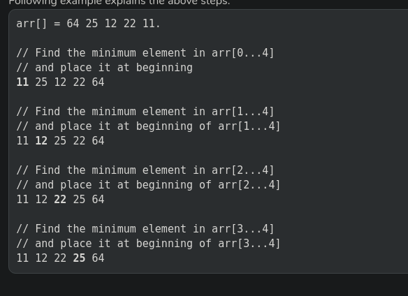

# Sorting

- A sorting algorithm is said to be stable if two objects with equal keys appear in the same order in sorted output as they appear in the input array to be sorted.
- inplace sorting means without any space required.
    - insertion sort
    - bubble sort
    - selection sort
    - quick sort
    - heap sort

## Insertion sort
- iterating from the second element of array till last element and for every element insert at its correct position in the subarray before it.
- Time: O(n^2),   Extra Space: no,     stable 

   

## Bubble sort
- In one iteration if we swap all adjacent elements of an array such that after swap the first element is less than the second element, 
- at each iteration 
- the algo stops when there is zero swap in a iteration
- Time: O(n^2),    Extra Space: no,     stable 

   

## Selection sort
- finding the minimum element (considering ascending order) from unsorted part and putting it at the beginning
- Time: O(n^2),   Extra Space: no,     not stable 

   

## Quick sort
- It picks an element as pivot and partitions the given array around the picked pivot.

- Time: O(n^2),   Extra Space: no,     not stable 

- **worst_case**: inc or dec order or all equal,    **best_case**: O(nlogn) partition always picks the middle element as pivot,   **avg_case**: Q(nlogn)

- **Lumto partition**: In one partion, pivot element comes to its sorted position, all elements right to it are lareger and left elements are smaller or equal.

- **Hoare partition**: It puts all the elements smaller than in left side and rest in right side. It is better than lumto partition bcoz it does 3 times fewer swaps on average. worst case is same when array is sorted. *it never swaps it array is already sorted*

- QuickSort is faster in practice, because its inner loop can be efficiently implemented in most real data.
- QuickSort can be implemented in different ways by changing the choice of pivot, so that the worst case rarely occurs for a given type of data
- merge sort is generally considered better when data is huge and stored in external storage.
- **worst space complexity for recursive call**: O(n) and **best case**: O(logn)

## Merge Sort
- it divides the input array in two halves, calls itself for the two halves and then merges the two sorted halves.

- Time: O(nlogn),   Extra Space: O(n),      stable: depends on implementation

- Time complexity of Merge Sort is Θ(nLogn) in all 3 cases (worst, average and best)

## Heap Sort
- Time: O(nlogn),   Extra Space: no,      stable: depends on implementation

- heapify- O(logn)

## Counting Sort
- Counting sort is a sorting technique based on keys between a specific range.

- Time: O(n+k),   Extra Space: O(n+k),      stable: depends on implementation

